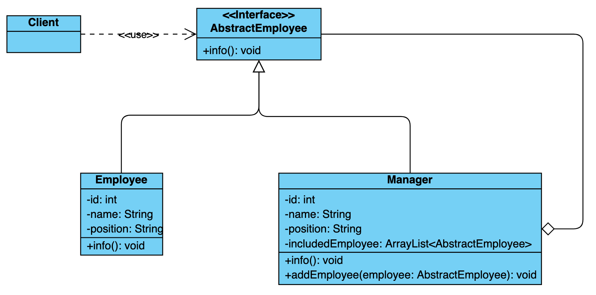

# Composite Design Pattern

Composite design pattern allows you to compose objects into a tree structure to represent part-whole hierarchies. Composite lets clients treat individual objects and compositions of objects uniformly.

